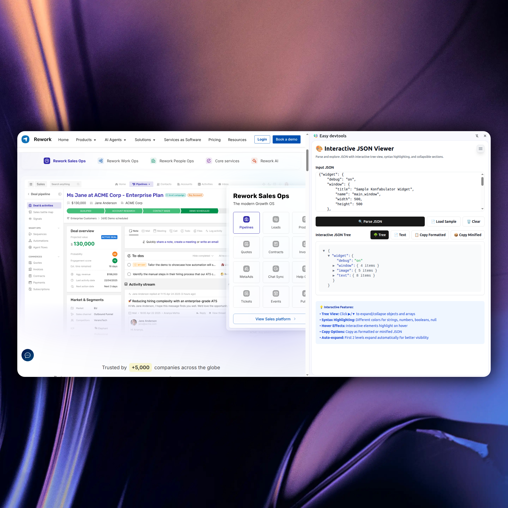

<p align="center">
   <!-- <video src="demo/demo.mp4"></video> -->
  
</p>
<p align="center">
  <em>🛠️ Easy DevTools - A comprehensive Chrome extension packed with essential developer utilities. Built with WXT, React, Tailwind CSS, Shadcn UI and TypeScript. Features dark mode and localization support.</em>
</p>
<p align="center">
    
    <a href="#"></a>
    <a href="#"></a>
</p>

---

## ✨ Features

Easy DevTools provides a comprehensive suite of developer utilities accessible right from your browser:

### 🔧 Core Developer Tools
- **📅 Date Converter** - Convert timestamps to readable dates and vice versa
- **🎨 JSON Beautifier** - Format and beautify JSON data with syntax highlighting
- **🔗 URL Encoder/Decoder** - Encode and decode URLs for web development
- **🔐 Base64 Encoder/Decoder** - Convert text to/from Base64 encoding
- **🔐 Hash Generator** - Generate MD5, SHA1, SHA256 and other hash values
- **🎨 Color Converter** - Convert between HEX, RGB, HSL color formats
- **📝 Markdown Preview** - Live preview of Markdown content

### 📸 Media & Capture Tools
- **📸 Screenshot Tool** - Capture screenshots with cropping capabilities
- **🎥 Video Recording** - Record screen activities with audio support
- **📄 File Generator** - Generate various file types and templates

### 🌐 Productivity Features
- **🌐 Text Translation** - Translate text between multiple languages
- **🔍 Smart Search** - Quickly find and access any tool
- **🌙 Dark Mode** - Eye-friendly dark theme support
- **🌍 Internationalization** - Multi-language interface support

## 🔐 Prerequisites

Before you get started, please make sure you have the following installed:

- An editor of your choice (e.g., [Visual Studio Code](https://code.visualstudio.com/download), WebStorm)
- [Node.js](https://nodejs.org/en/download) (version 22 or higher)
- [Git](https://git-scm.com/downloads)

## 🚀 Getting Started

1. **Clone the Repository**
   ```bash
   git clone https://github.com/your-username/easy-devtools.git
   cd easy-devtools
   ```

2. **Install Dependencies**
   ```bash
   npm install
   # or
   pnpm install
   ```

3. **Start Development Server**
   ```bash
   npm run dev
   # or
   pnpm dev
   ```

4. **Load Extension in Chrome**
   - Open Chrome and navigate to `chrome://extensions/`
   - Enable "Developer mode" in the top right
   - Click "Load unpacked" and select the `.output/chrome-mv3` directory
   - The extension will appear in your browser toolbar

## 🎯 How to Use

1. **Access Tools**: Click the extension icon in your browser toolbar to open the side panel
2. **Quick Search**: Use the search bar to quickly find specific tools
3. **Tool Categories**: Browse tools by category or use the grid view
4. **Keyboard Shortcuts**: Use keyboard shortcuts for faster access to frequently used tools

### Tool Usage Examples

- **Date Converter**: Select timestamp text on any webpage and convert it instantly
- **JSON Beautifier**: Copy JSON data and beautify it with proper formatting
- **Screenshot Tool**: Capture any part of your screen with built-in editing tools
- **Color Converter**: Convert colors between different formats for CSS development

## ❇️ Tech Stack

- ✅ **[WXT](https://wxt.dev)** - Modern web extension framework
- ✅ **[React](https://react.dev/)** - UI library for building interactive interfaces
- ✅ **[TypeScript](https://www.typescriptlang.org/)** - Type-safe JavaScript development
- ✅ **[Tailwind CSS](https://tailwindcss.com)** - Utility-first CSS framework
- ✅ **[Shadcn UI](https://ui.shadcn.com)** - Beautiful and accessible UI components
- ✅ **[Heroicons](https://heroicons.com/)** - Beautiful hand-crafted SVG icons

## 🌍 Localization

Easy DevTools supports multiple languages out of the box:

- **English** (default)
- **简体中文** (Simplified Chinese)

## 🤝 Contributing

We welcome contributions! Please see our [Contributing Guide](CONTRIBUTING.md) for details.

1. Fork the repository
2. Create your feature branch (`git checkout -b feature/amazing-feature`)
3. Commit your changes (`git commit -m 'Add some amazing feature'`)
4. Push to the branch (`git push origin feature/amazing-feature`)
5. Open a Pull Request

## 📄 License

This project is licensed under the MIT License - see the [LICENSE](LICENSE) file for details.

## 🙏 Acknowledgments

- Built with [WXT](https://wxt.dev) - The next-gen web extension framework
- UI components from [Shadcn UI](https://ui.shadcn.com)
- Icons from [Heroicons](https://heroicons.com/)

---

<p align="center">
  <strong>Made with ❤️ for developers, by developers</strong>
</p>

## 👨‍🚀About Me

- Full-Stack Engineer

- Once worked at [Rework.com](https://rework.com)

[Github](https://github.com/caobo171)  
[Twitter/X](https://x.com/Kaonguyen171)  

If this project is helpful to you, star the repo and buy me a coffee, thank you guys.

<a href="https://www.buymeacoffee.com/caobo171" target="_blank"></a>

